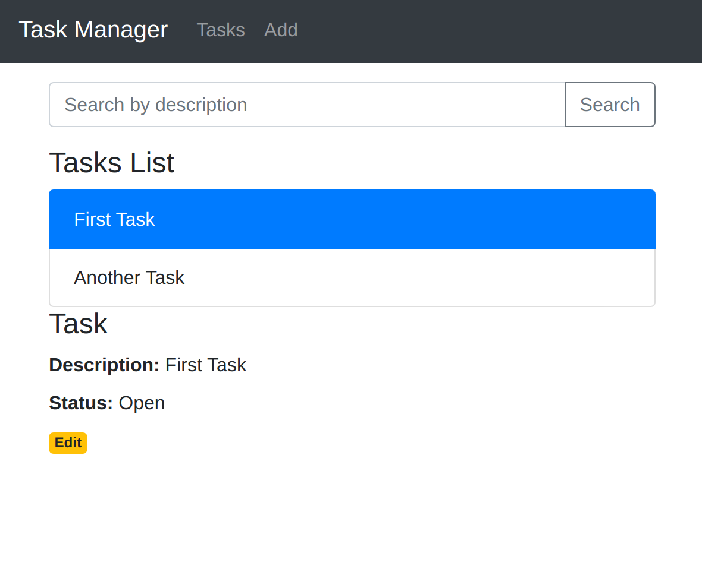
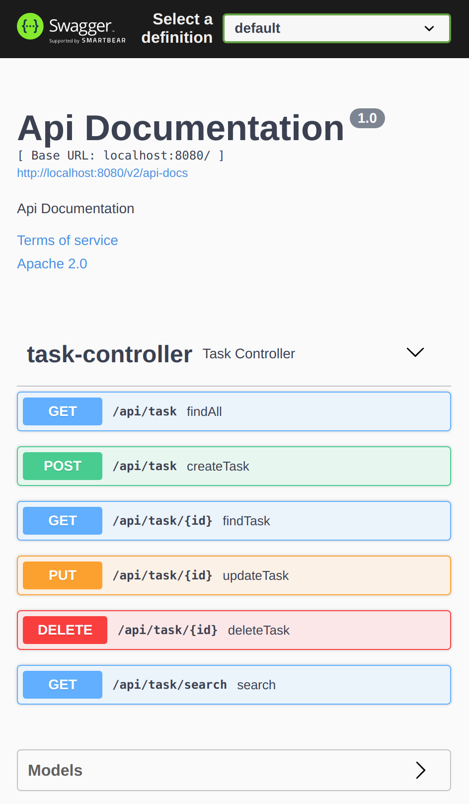

# Building reactive Web applications with React, Kotlin and Spring

## Introduction
The traditional servlet based
[Spring MVC](https://docs.spring.io/spring/docs/current/spring-framework-reference/web.html) 
stack spawns a thread for every
incoming request. This overhead is necessary, since the thread gets blocked by any I/O
operation performed by the servlet. Spring 5 has introduced support for
[WebFlux](https://docs.spring.io/spring/docs/current/spring-framework-reference/web-reactive.html)
which is a fully asynchronous and non-blocking reactive web stack.

Several performance tests (
[1](https://medium.com/@filia.aleks/microservice-performance-battle-spring-mvc-vs-webflux-80d39fd81bf0)
[2](https://medium.com/@the.raj.saxena/springboot-2-performance-servlet-stack-vs-webflux-reactive-stack-528ad5e9dadc#:~:text=Spring%205%20introduced%20WebFlux%20framework,load%20on%20the%20same%20hardware.&text=*%20A%20third%20PersonService%20based%20on,boot%20reactive%2Dweb%2D2.0.)
[3](https://blogs.sap.com/2018/08/03/spring-boot-reactive-vs.-node.js-in-sap-cloud-platform-reflection-on-throughput-measurement)
) have shown that the non-blocking approach can increase request/response throughput by factors, while keeping
CPU utilization and memory footprint on comparable levels.

WebFlux is based on project [Reactor](https://projectreactor.io) and uses its publisher implementations,
[Flux](https://projectreactor.io/docs/core/release/api/reactor/core/publisher/Flux.html)
and [Mono](https://projectreactor.io/docs/core/release/api/reactor/core/publisher/Mono.html).
In order to develop, debug and test WebFlux applications, developers need to learn a functional programming model
which is quite different from the imperative model used in traditional Spring MVC applications.

As an alternative to learning WebFlux, 
[Spring 5 also offers the option](https://spring.io/blog/2017/01/04/introducing-kotlin-support-in-spring-framework-5-0)
to build reactive web applications using [Kotlin](https://kotlinlang.org)
or more specifically [Kotlin Coroutines](https://kotlinlang.org/docs/reference/coroutines-overview.html).
For readers who know JavaScript's async/await concept, this
[comparison](https://medium.com/@joffrey.bion/kotlins-suspend-functions-are-not-javascript-s-async-they-are-javascript-s-await-f95aae4b3fd9)
with Kotlin's suspend functions helps to understand the concept.

Using a _Task-Manager_ application this project demonstrates how to build a reactive web application
with Kotlin and Spring in the backend. It intentionally exceeds the scope of a _Hello World_ application
and contains a [React](https://reactjs.org) frontend written in [Typescript](https://www.typescriptlang.org).



## Building and Running the Task-Manager Application
In order to build and run the task-manager application first make sure
that the following software is installed:
* docker
* docker-compose
* Java Development Kitt version 11 (e.g. OpenJDK 11)
* node.js version 12
* yarn

### 1. Start the Postgres Database
The tasks are persisted in a postgres database.
It can be started with the following commands in the project directory:
```
cd docker
docker-compose up
```
This command also starts [adminer](https://www.adminer.org),
which is a web based database administration tool
available under [http://localhost:8090](http://localhost:8090).


Use the following attributes for logging in:
* **Database System:** PostgreSQL
* **Server:** db
* **User:** postgres
* **Password:** example
* **Database:** postgres

### 2. Build and start the Spring backend
From the project directory build and start the backend using gradle:
```
./gradlew bootRun
```
Upon start the backend automatically creates the required database schema.
Task-Manager uses swagger to automatically document its API.
Swagger can be viewed under
[http://localhost:8080/swagger-ui/index.html](http://localhost:8080/swagger-ui/index.html).



### 3. Build and start the React frontend
Build and start the frontend using yarn:
```
cd task-browser
yarn build
yarn start
```
The frontend is reachable under [http://localhost:3000](http://localhost:3000)

## Task-Manager backend
The folder `task-service` contains the Task-Manager backend.

### Database Layer
The non-blocking web application requires, that all I/O operations are non-blocking, too.
This means the conventional
[jdbc](https://en.wikipedia.org/wiki/Java_Database_Connectivity)
database drivers cannot be used.
Instead [r2dbc](https://r2dbc.io) drivers are required.
Databases that support R2DBC include Postgres, H2, and Microsoft SQL Server.
Oracle currently does not support R2DBC.

The backend is inspired by the project
[webflux-r2dbc-kotlin](https://github.com/razvn/webflux-r2dbc-kotlin).
It utilizes [spring-data-r2dbc](https://spring.io/projects/spring-data-r2dbc)
to wrap the r2dbc driver and provide reactive 
[data repositories](https://docs.spring.io/spring-data/r2dbc/docs/current/reference/html/#repositories).
However, the _webflux-r2dbc-kotlin_ project still relies on Flux/Mono in the repository.
Since Spring 5.2 it is now possible to extend `CoroutineCrudRepository` and return Kotlin
[Flows](https://kotlinlang.org/docs/reference/coroutines/flow.html) from the repository functions:
```
@Repository
interface TaskRepository : CoroutineCrudRepository<Task, Long> {

    fun findByDescriptionContainingIgnoreCase(description: String): Flow<Task>

    @Query("SELECT t.* FROM task t WHERE t.completed = :completed")
    fun findByCompleted(completed: Boolean): Flow<Task>

}
``` 

### Service Layer
The service layer contains `suspend` functions that allow an imperative programming model.
```
@Service
class TaskService(private val taskRepository: TaskRepository) {
    ...
    suspend fun update(id: Long, taskDTO: TaskDTO): Task? {
        if(findById(id)==null) return null
        return taskRepository.save(taskDTO.toModel(withId = id))
    }
    ...
}
```

### API Layer
In the API layer it is possible to use the traditional Spring `@RestController` and
handler methods that return Flows, too.
```
@RestController
@RequestMapping("/api")
class TaskController(private val taskService: TaskService, private val userService: UserService) {
    ...
    @GetMapping("/task")
    suspend fun findAll(): Flow<Task> {
        return taskService.findAll()
    }
    ...
}
```
### Caveats
Unfortunately the Coroutine support is not yet available in all Spring projects.
As pointed out in this
[issue](https://github.com/spring-projects/spring-security/issues/8143),
Spring Security currently does not support annotations like `@PreAuthorize`
with handlers returning `Flow`.`Mono` or `Flux` are still required, here.

## Task-Manager frontend
The folder `task-browser` contains the Task-Manager React frontend.
It is inspired by the
[react-crud-web-api](https://github.com/bezkoder/react-crud-web-api) project
but has been rewritten in Typescript.
For a detailed explanation refer to the
[project webpage](https://bezkoder.com/react-crud-web-api/).
